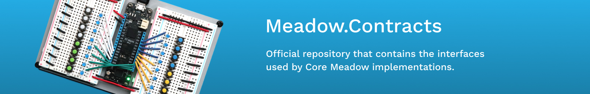

[](https://www.nuget.org/packages/Meadow.Contracts)
[](https://github.com/WildernessLabs/Meadow.Contracts/actions/workflows/ci-develop-push.yml)



# Meadow.Contracts

**Meadow.Contracts** provides the core interfaces and contracts for the Meadow IoT platform. This library defines the fundamental abstractions for hardware interaction, peripheral communication, and platform services that power Meadow applications.

Whether you're building drivers for sensors, displays, or other hardware peripherals, or creating platform-specific implementations, Meadow.Contracts provides the strongly-typed interface definitions you need.

## Contents
* [Getting Started](#getting-started)
* [Hardware Contracts](#hardware-contracts)
  * [IO Controllers](#io-controllers)
  * [Communication Buses](#communication-buses)
  * [Pin Definitions](#pin-definitions)
* [Peripheral Interfaces](#peripheral-interfaces)
  * [Sensors](#sensors)
  * [Displays](#displays)
* [Platform Abstractions](#platform-abstractions)
* [Dependencies](#dependencies)
* [Contributing](#contributing)
* [License](#license)

## Getting Started

Install the Meadow.Contracts NuGet package:

```bash
dotnet add package Meadow.Contracts
```

Or via Package Manager:

```powershell
Install-Package Meadow.Contracts
```

## Hardware Contracts

Meadow.Contracts defines the core hardware abstraction interfaces that allow you to interact with device capabilities in a platform-independent way.

### IO Controllers

The IO controller interfaces provide access to various input/output capabilities:

* **`IDigitalInputController`** - Read digital signals from pins
* **`IDigitalOutputController`** - Write digital signals to pins
* **`IDigitalInterruptController`** - Handle digital signal interrupts
* **`IAnalogInputController`** - Read analog voltage values
* **`IPwmOutputController`** - Generate PWM (Pulse Width Modulation) signals
* **`IBiDirectionalController`** - Support pins that can be both input and output

These controllers abstract the underlying hardware capabilities and provide a consistent API across different devices.

### Communication Buses

Meadow.Contracts defines interfaces for common communication protocols:

* **`II2cBus`** - I²C (Inter-Integrated Circuit) communication
* **`ISpiBus`** - SPI (Serial Peripheral Interface) communication
* **`ISerialPort`** - UART serial communication

These interfaces allow peripheral drivers to communicate with hardware devices without knowing the underlying platform implementation.

### Pin Definitions

The `IPinDefinitions` interface provides access to a device's available pins:

```csharp
public interface IPinDefinitions : IEnumerable<IPin>
{
    IList<IPin> AllPins { get; }
    IPin this[string name] { get; }
    IPinController? Controller { get; set; }
}
```

Example usage:

```csharp
// Access pins by name
var pin = device.Pins["D02"];

// Enumerate all available pins
foreach (var pin in device.Pins.AllPins)
{
    Console.WriteLine($"Pin: {pin.Name}, Key: {pin.Key}");
}
```

## Peripheral Interfaces

Meadow.Contracts defines standard interfaces for common hardware peripherals, making it easy to write device drivers that work across the entire Meadow ecosystem.

### Sensors

The library includes interfaces for a wide variety of sensor types:

* **`ITemperatureSensor`** - Temperature measurement
* **`IHumiditySensor`** - Relative humidity sensing
* **`IBarometricPressureSensor`** - Atmospheric pressure measurement
* **`IAccelerometer`** - Motion and acceleration detection
* **`ILightSensor`** - Ambient light measurement
* **`IButton`** - Button press detection with click events

Example using a temperature sensor:

```csharp
public class MyApp : App<F7FeatherV2>
{
    ITemperatureSensor temperatureSensor;

    public override Task Initialize()
    {
        // Create a temperature sensor instance
        temperatureSensor = new Bme280(Device.CreateI2cBus());

        // Subscribe to temperature changes
        var consumer = ITemperatureSensor.CreateObserver(
            handler: result =>
            {
                Console.WriteLine($"Temperature: {result.New.Celsius:N2}°C");
                Console.WriteLine($"Temperature: {result.New.Fahrenheit:N2}°F");
            },
            filter: null
        );

        temperatureSensor.Subscribe(consumer);

        // Start updating
        temperatureSensor.StartUpdating(TimeSpan.FromSeconds(5));

        return Task.CompletedTask;
    }
}
```

### Displays

Display interfaces support various types of visual output:

* **`IDisplay`** - Base display interface
* **`IPixelDisplay`** - Pixel-addressable displays (e.g., LCD, OLED)
* **`ITextDisplay`** - Character-based displays (e.g., LCD character displays)

These interfaces work seamlessly with the Meadow.Foundation graphics library.

## Platform Abstractions

Meadow.Contracts provides abstractions for platform-level services:

* **`IPlatformOS`** - Operating system services including file system, networking configuration, and power management
* **`IMeadowDevice`** - Core device abstraction providing access to device information, pins, and platform capabilities
* **`INetworkAdapter`** - Network connectivity abstractions for WiFi, Ethernet, and cellular

These interfaces allow application code to remain platform-independent while accessing device-specific features.

## Dependencies

Meadow.Contracts depends on:

* **[Meadow.Units](https://github.com/WildernessLabs/Meadow.Units)** - Strongly-typed unit system for physical measurements (Temperature, Pressure, Voltage, etc.)
* **[Meadow.Logging](https://github.com/WildernessLabs/Meadow.Logging)** - Logging abstractions for Meadow applications

## Contributing

Meadow.Contracts is an open-source project by [Wilderness Labs](https://www.wildernesslabs.co/) and we encourage community contributions. For details on how to contribute, please see the [Contributing Guide](Contributing.md).

## License

Meadow.Contracts is licensed under the Apache 2.0 License.
